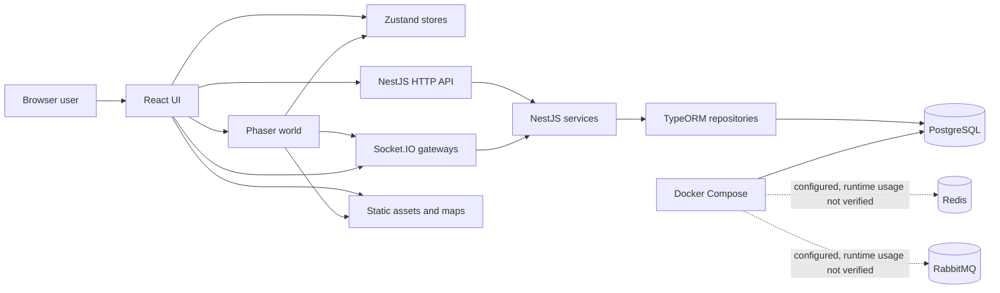

# Architecture Overview

## Metadata

- Status: Draft
- Owner: Project
- Last updated: 2026-06-18
- Depends on: docs/README.md, README.md, CLAUDE.md, STATUS.md
- Used by: Project owner, developers, conversational assistants, repository-aware coding agents

## Scope

This document gives a high-level overview of the architecture currently present
in the repository.

It is a starting point before reading specialized documents. It describes what
was observed in the code and marks uncertain or incomplete areas as `TBD` or
`Not verified`.

## Verification labels

- `Implemented`: verified in the current repository code.
- `Configured`: present in configuration, but runtime usage may not be verified.
- `Not verified`: the inspected code did not provide enough evidence.
- `TBD`: intentionally unresolved or still to be documented.

These labels describe only the state observed at `Last updated`.

## System context

Implemented:

- Browser client served by Vite.
- React application with routes for login, character creation, and world view.
- Phaser world embedded inside the React world page.
- Zustand stores shared between React UI and Phaser systems.
- NestJS API gateway for HTTP routes and Socket.IO gateways.
- PostgreSQL persistence through TypeORM entities and repositories.
- Socket.IO real-time communication for world presence, resources, creatures, and
  admin commands.
- Admin UI exposed inside the React game layout for users whose JWT role is
  `admin`.
- The JWT role can control admin UI display in React, but this display is not
  authorization.
- Static assets under `apps/client/public/assets/`.
- Docker Compose configuration for PostgreSQL, Redis, and RabbitMQ.

Configured, present, or not fully verified:

- Tiled-style map data and collision files exist under client assets and Phaser
  map helpers, but the active world scene mainly uses direct Phaser objects in
  the inspected code.
- Redis and RabbitMQ are configured in Docker but no code usage was verified.

## Repository structure

```text
apps/
  api-gateway/
  client/
packages/
  shared/
tools/
  cli/
docker/
  docker-compose.yml
```

### apps/client

Role: browser game client.

Responsibilities:

- Render React pages and UI panels.
- Create the Phaser game instance in the world page.
- Store client-side UI and character state with Zustand.
- Connect to the NestJS server through HTTP and Socket.IO.
- Load static assets from `public/assets`.

Main entry files:

- `apps/client/src/main.jsx`
- `apps/client/src/App.jsx`
- `apps/client/src/pages/WorldPage.jsx`
- `apps/client/src/phaser/core/WorldScene.js`

Important dependencies:

- React
- Vite
- React Router
- Phaser
- Zustand
- Socket.IO Client
- Sass

### apps/api-gateway

Role: NestJS backend and real-time gateway.

Responsibilities:

- Authenticate users with JWT.
- Expose HTTP routes for auth, characters, inventory, items, and admin data.
- Expose Socket.IO gateways for world state, resources, creatures, and admin
  commands.
- Persist game data in PostgreSQL through TypeORM.
- Serve Swagger documentation for HTTP APIs.

Main entry files:

- `apps/api-gateway/src/main.ts`
- `apps/api-gateway/src/app.module.ts`

Important dependencies:

- NestJS
- TypeORM
- PostgreSQL driver
- Passport JWT
- Socket.IO
- Swagger
- class-validator

### packages/shared

Role: minimal shared package.

Responsibilities:

- Provide shared constants.

Main entry files:

- `packages/shared/index.js`

Important dependencies:

- None verified.

### tools/cli

Role: root-level utility folder.

Responsibilities:

- Contains formatting utility code.

Main entry files:

- `tools/cli/utils/format.ts`

Important dependencies:

- Not verified.

### apps/api-gateway/tools/cli

Role: backend entity/module generator.

Responsibilities:

- Scaffold backend entities, DTOs, services, controllers, modules, and seed
  files through the `make:entity` npm script.

Main entry files:

- `apps/api-gateway/tools/cli/index.ts`

Important dependencies:

- `ts-node`
- `inquirer`

### docker

Role: local infrastructure.

Responsibilities:

- Configure PostgreSQL.
- Configure Redis.
- Configure RabbitMQ with management UI.

Main entry files:

- `docker/docker-compose.yml`

Important dependencies:

- Docker
- Docker Compose

## Runtime responsibilities

### React

Implemented:

- Defines routes for `/`, `/create-character`, and `/world`.
- Renders login, character creation, world layout, inventory, action panel, and
  admin panel.
- Reads and stores JWT in browser storage through existing page logic.
- Calls HTTP endpoints through `fetch`.

### Phaser

Implemented:

- Renders the world scene, player, remote players, resources, creatures, and HP
  bars.
- Handles pointer movement, keyboard movement, simple pathfinding fallback, and
  direct steering.
- Emits Socket.IO events for world join, movement, resource interaction, creature
  attack, and admin commands.

Not verified:

- Full Tiled map rendering in the active world scene.

### Zustand

Implemented:

- Stores character, inventory, equipment, action panel, item, and admin UI
  state.
- Uses a singleton character store attached to the browser window so React and
  Phaser share the same client-side state.

### NestJS

Implemented:

- Bootstraps global validation pipes.
- Enables CORS using configured client origin.
- Configures Swagger.
- Loads Auth, Common, Characters, Inventory, Resources, World, Creatures, and
  Admin modules.

### Socket.IO

Implemented:

- Authenticates Socket.IO connections with JWT in shared gateway logic.
- Handles world presence and movement.
- Handles resource gathering.
- Handles creature listing and attacks.
- Handles admin commands for spawn, teleport, template update, creature move, and
  respawn.

### TypeORM

Implemented:

- Connects to PostgreSQL through `ConfigService`.
- Auto-loads entity files.
- Uses `synchronize: true` in development.
- Defines entities for users, characters, equipment, inventory, items,
  resources, creatures, creature templates, creature spawns, and respawn points.

### PostgreSQL

Implemented:

- Stores persistent users, characters, inventory, items, resources, creatures,
  creature data, and respawn data through TypeORM.

## State ownership and persistence

Implemented:

- React, Phaser, and Zustand maintain local or transient client-side state.
- Zustand state is not a source of truth for the server.
- The world gateway maintains some presence and position state in memory.
- Server memory state is not automatically persistent.
- PostgreSQL contains persistent state managed through TypeORM.
- Saved database position and in-memory connected-player position are distinct.

Not verified:

- Complete synchronization or crash recovery between in-memory world state and
  persisted database state.

Architecture constraint:

- Security-sensitive gameplay decisions must remain validated server-side.

TBD:

- Define and document the authoritative source for each gameplay and world-state
  domain.

## Tiled and map data

Implemented:

- Client asset folder contains `world.json`, `collisions.json`, and tileset
  assets.
- Phaser map helper code exists for tilemap and collision setup.

Not verified:

- Active runtime usage of `world.json` in the inspected `WorldScene`.

## Main data flows

### Authentication

Implemented:

1. React login/register code calls `/auth/login` or `/auth/register`.
2. NestJS AuthController delegates to AuthService.
3. AuthService returns JWT data for authenticated users.
4. The client stores the token and sends it with protected HTTP requests.
5. Socket.IO connections send the token through the handshake auth payload.

### Character loading and selection

Implemented:

1. `WorldPage` checks for a token.
2. Zustand `character.store.js` calls `GET /characters/me`.
3. The server validates JWT through `JwtAuthGuard`.
4. Character data, equipment, and inventory are stored in Zustand.
5. If no character is found, the client redirects to character creation.

### Real-time connection

Implemented:

1. `WorldPage` creates one Socket.IO client with JWT auth.
2. The socket is attached to the Phaser game instance.
3. `WorldScene` reads the socket from the game object.
4. Server gateways authenticate connections with `WsAuthService`.

### Movement

Implemented:

1. Phaser computes local movement from keyboard, pointer click pathfinding, or
   pointer drag steering.
2. `WorldScene` emits `join_world` and `player_move`.
3. `WorldGateway` checks basic payload shape and updates the in-memory player.
4. Other clients receive movement through broadcast events.
5. Position is persisted when the socket disconnects.

Not verified:

- Server-side movement speed, collision, blocked-zone, or teleport validation
  for normal player movement.

### Admin commands

Implemented:

1. `CharacterLayout` shows the admin tab when the JWT role is `admin`.
2. `AdminPanel` calls admin HTTP endpoints for overview and templates.
3. Admin commands are parsed in the client and emitted through Socket.IO.
4. `AdminController` uses JWT and role guards.
5. `AdminGateway` checks `client.data.role === 'admin'` before sensitive admin
   Socket.IO actions.

Security note:

- React-side admin visibility is not authorization.
- Server-side controls observed in code are the NestJS HTTP guards and gateway
  role checks listed above.
- Any admin action sent by a client remains untrusted.
- This does not prove that every possible future admin action is protected.

### Persistence

Implemented:

- TypeORM repositories persist users, characters, inventory, items, resources,
  creatures, creature templates, creature spawns, and respawn points.
- Character position is persisted on disconnect and during admin teleport.
- Resource gathering updates inventory and resource state.
- Creature combat and respawn logic use server-side services and entities.

TBD:

- Production migration strategy.

## Trust boundaries

- The browser client is not trusted.
- The React admin interface is not trusted.
- Phaser, Zustand, client-side maps, and client-side tile properties are not
  server authority.
- The NestJS server must remain authoritative for security-sensitive gameplay
  decisions.
- Client-side prediction and rendering may exist, but server validation must be
  checked before treating gameplay effects as accepted.

These statements are architecture constraints, not proof that every validation
is already implemented.

## Deployment and infrastructure

Implemented:

- Root `package.json` declares npm workspaces for `apps/*` and `packages/*`.
- Client scripts exist for dev, build, lint, and preview.
- API scripts exist for start, start:dev, build, lint, tests, e2e tests,
  coverage, and `make:entity`.
- Docker Compose defines PostgreSQL, Redis, and RabbitMQ.
- PostgreSQL is used by the NestJS API through TypeORM.

Configured but not verified as used by code:

- Redis.
- RabbitMQ.

Expected environment variable names:

- Root Docker Compose: `POSTGRES_USER`, `POSTGRES_PASSWORD`, `POSTGRES_DB`.
- API: `PORT`, `CLIENT_ORIGIN`, `JWT_SECRET`, `DB_HOST`, `DB_PORT`,
  `DB_USERNAME`, `DB_PASSWORD`, `DB_NAME`.
- Client: `VITE_API_URL`.

No real environment values are documented here.

## Known architectural gaps

- Several specialized architecture documents are still `Draft` or skeletons.
- No real ADR exists yet.
- Server-side validation for normal movement speed, map collisions, blocked
  zones, and forbidden teleports was not verified.
- Some Socket.IO events use broad broadcasts or `server.emit`; rooms, zones, or
  chunks are not yet documented as implemented.
- TypeORM uses `synchronize: true` for development; production migrations are
  still to be defined.
- Redis and RabbitMQ are configured locally but no runtime usage was verified.
- Tiled-style files and map helpers exist, but active world-map rendering from
  `world.json` was not verified.

## Architecture diagram



## Non-goals

- This document does not define new architecture.
- This document does not replace specialized documentation.
- This document does not create ADRs.
- This document does not prove that configured, `TBD`, or unverified behavior is
  implemented or active at runtime.
- This document does not document every file in the repository.

## Security notes

- The client and admin UI are untrusted.
- The server must remain authoritative for gameplay.
- Do not copy secrets or real `.env` values into documentation.
- Any future architecture change that affects trust boundaries should be
  reviewed and may require an ADR.

## Performance notes

This document has no runtime impact.

Current performance concerns observed in project documentation and code include
broad Socket.IO broadcasts, future rooms, zones, or chunk-scoped communication,
client and server entity volume, and memory and network scalability.

## Related files

- [Documentation Index](../README.md)
- [Architecture Decisions](decisions.md)
- [ADR Process](adr/README.md)
- [Client Server Boundaries](client-server-boundaries.md)
- [Client Server Trust](../02_Security/client-server-trust.md)
- [Golden Rules](../10_AI/golden-rules.md)
- [AI Assistant Workflow](../09_Workflow/ai-assistant-workflow.md)
- [Root README](../../README.md)
- [CLAUDE.md](../../CLAUDE.md)
- [STATUS.md](../../STATUS.md)

## Open questions

- Should movement validation be formalized in an ADR?
- When should Redis or RabbitMQ usage be introduced, if at all?
- When should TypeORM migrations replace development `synchronize` usage?
- How should Tiled map data become part of authoritative server-side world
  validation?

## TODO

- [ ] Fill specialized architecture documents.
- [ ] Create ADRs only for real validated architecture decisions.
- [ ] Verify movement, collision, and map authority before marking related
  behavior as implemented.
- [ ] Update this overview when specialized documents become `Review` or
  `Stable`.
