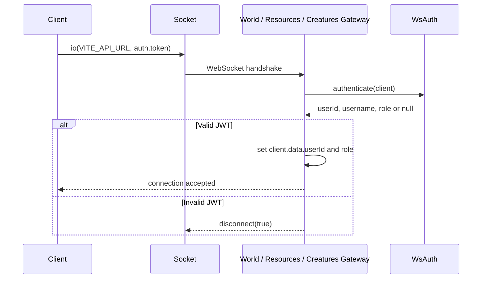
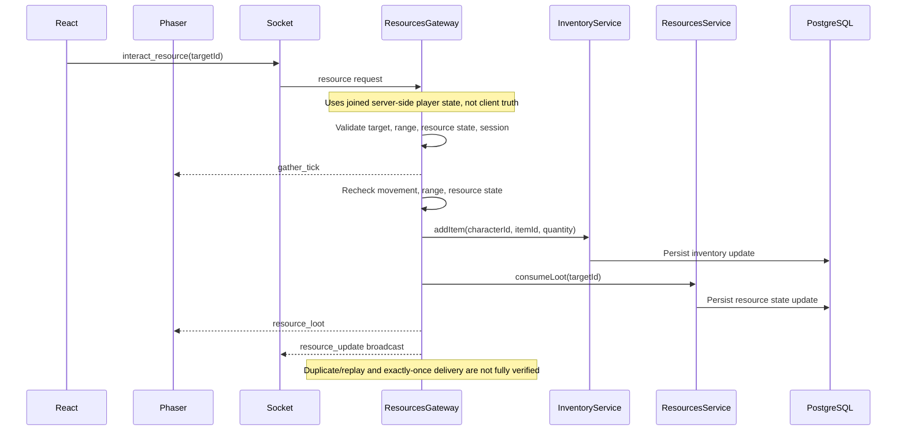

# Realtime Socket.IO

## Metadata

- Status: Draft
- Owner: Project
- Last updated: 2026-06-18
- Depends on: docs/README.md, docs/01_Architecture/overview.md, docs/01_Architecture/client-server-boundaries.md
- Used by: Project owner, developers, conversational assistants, repository-aware coding agents

## Scope

This document describes the real-time Socket.IO architecture observed in the
current repository.

It covers client socket creation, WebSocket JWT authentication, NestJS
gateways, client-to-server events, server-to-client events, in-memory gateway
state, broadcasts, persistence side effects, security boundaries, and scalability
limits.

## Verification labels

- `Implemented`: verified in the current repository code.
- `Configured`: present in configuration, but runtime usage may not be verified.
- `Not verified`: the inspected code did not provide enough evidence.
- `TBD`: intentionally unresolved or still to be documented.

These labels describe only the state observed at `Last updated`.

## Purpose

This document is a descriptive overview of the real-time flows that exist now.
It does not define a new Socket.IO architecture.

Client events must be treated as requests or intentions. A message received
from the client is not gameplay truth until the server validates it and applies
the corresponding state change.

## Socket lifecycle

Implemented:

- `WorldPage.jsx` creates a Socket.IO client with `io(import.meta.env.VITE_API_URL, { auth: { token } })`.
- The token comes from browser `localStorage`.
- The socket is created before the Phaser game instance.
- The socket is attached to `phaserGameRef.current.socket`.
- The Phaser game is also exposed as `window.game`, which lets React components
  and Phaser helpers access `window.game.socket`.
- `WorldScene` reads the socket from the Phaser game instance.
- `WorldScene` registers listeners for world, resource, creature, and character
  events.
- If the socket is already connected when listeners are registered, `WorldScene`
  emits `get_resources`, `get_creatures`, and `join_world`.
- On socket `connect`, `WorldScene` emits `get_resources`, `get_creatures`, and
  `join_world`.
- `WorldPage` avoids creating another Phaser game and socket while
  `phaserGameRef.current` exists.
- `WorldPage` destroys the Phaser game on cleanup.
- `WorldScene.destroy()` removes several registered Socket.IO listeners.

Not verified:

- Explicit socket disconnection during `WorldPage` cleanup.
- Destroying Phaser does not prove that the Socket.IO connection is closed.
- A persistent connection after unmount or a later world entry could create
  multiple connections or duplicate listeners.
- This behavior must be verified by code inspection or runtime testing.
- A single socket instance is verified only for the observed `WorldPage`
  lifecycle, not as a global application guarantee.
- Full listener cleanup for every listener registered by `WorldScene`.
- Reconnection resynchronization beyond the `connect` listener behavior.
- Whether the unused `SocketService` in `apps/client/src/phaser/network/socket.js`
  is active in the runtime path inspected here.

## Authentication boundary

Implemented:

- The client sends the JWT in the Socket.IO handshake `auth.token` field.
- `WsAuthService` also supports an `Authorization: Bearer ...` handshake header.
- `WsAuthService` verifies the JWT with `JwtService.verifyAsync`.
- A valid token returns `userId`, optional `username`, and optional `role`.
- `WorldGateway`, `ResourcesGateway`, and `CreaturesGateway` call
  `WsAuthService.authenticate` in `handleConnection`.
- Invalid authentication disconnects the socket with `client.disconnect(true)`.
- Authenticated gateways store `client.data.userId` and `client.data.role`.

Authorization boundary:

- Authentication proves the socket was connected with a valid token.
- Authorization is still event-specific.
- `join_world` verifies that the joined character belongs to
  `client.data.userId`.
- Resource and creature events require a joined player in `client.data.player`.
- Admin events check `client.data.role === 'admin'`.

Not verified:

- Whether `AdminGateway` independently authenticates sockets in its own
  connection hook. The observed role checks depend on `client.data.role` already
  being populated by authenticated gateway handling on the shared socket.
- Whether `client.data.role` is always initialized by a server-side
  authentication path before an admin event can be handled.
- The connection hook execution order across gateways sharing the default
  namespace.
- A simple check for the presence or value of `client.data.role` must not be
  treated as sufficient unless the role provenance is guaranteed.
- Token refresh or token expiration handling after a socket is already
  connected.

## Gateway inventory

| Gateway | Namespace | Main responsibility | Authentication | In-memory state | Status |
|---|---|---|---|---|---|
| `WorldGateway` | Default namespace | Join world, track connected players, broadcast presence and movement, persist position on disconnect. | Uses `WsAuthService` in `handleConnection`. | `WorldService.connectedPlayers`; `client.data.player`; `client.data.userId`; `client.data.role`. | Implemented |
| `ResourcesGateway` | Default namespace | Send resources, handle gathering sessions, validate gathering range and movement, emit loot and resource updates. | Uses `WsAuthService` in `handleConnection`. | `gatherSessions`; `client.data.userId`; `client.data.role`; joined player data from shared socket. | Implemented |
| `CreaturesGateway` | Default namespace | Send creatures, handle creature attacks, emit creature and character damage updates. | Uses `WsAuthService` in `handleConnection`. | Delegates live creature, patrol, and cooldown state to `CreaturesService`; uses joined player data from shared socket. | Implemented |
| `AdminGateway` | Default namespace | Handle observed admin spawn, teleport, template update, creature move, and respawn commands. | Event handlers check `client.data.role === 'admin'`; no independent `handleConnection` authentication hook was observed, and role provenance before admin handling remains to be verified. | Uses world and creature service state; relies on socket data populated elsewhere. | Implemented / Not verified |

## Event registry

### Client to server

| Event | Sender | Gateway | Payload summary | Server checks observed | Side effects | Status |
|---|---|---|---|---|---|---|
| `get_resources` | `WorldScene` | `ResourcesGateway` | No payload. | Authenticated connection expected. | Sends current resources to the client. | Implemented |
| `get_creatures` | `WorldScene` | `CreaturesGateway` | No payload. | Authenticated connection expected. | Sends current creatures to the client. | Implemented |
| `join_world` | `WorldScene` | `WorldGateway` | Character id, name, sex, local x/y, direction. | Payload must contain `characterId` and `name`; server loads character and checks ownership against `client.data.userId`. | Adds connected player memory, sets `client.data.player`, emits current players and presence events. | Implemented |
| `player_move` | `WorldScene` | `WorldGateway` | x, y, optional direction. | Checks that x and y are numbers; joined player must exist in server memory. | Updates connected-player memory and broadcasts `player_moved`. | Implemented / Not verified |
| `interact_resource` | `ActionPanel` | `ResourcesGateway` | Resource target id; client also sends character id but server uses joined socket player. | Valid target id, joined player, resource existence, resource state, range, duplicate same-target gathering, movement during cycle. | Starts or switches gathering session, emits ticks, grants loot, updates inventory, consumes resource. | Implemented |
| `attack_creature` | `WorldScene` | `CreaturesGateway` | Creature target id; client also sends character id but gateway uses joined socket player. | Valid target id, joined player, creature existence, character existence, character alive, cooldown, attack range. | Applies damage, may apply riposte, may trigger respawn, emits creature and character updates. | Implemented |
| `admin:spawn` | Admin helpers | `AdminGateway` | Template key, x, y. | `client.data.role === 'admin'`; payload fields present and numeric where required; template exists. | Creates creature spawn and emits `creature_update`. | Implemented |
| `admin:teleport` | Admin helpers | `AdminGateway` | Character id or name, x, y. | `client.data.role === 'admin'`; payload fields present; connected player resolved. | Updates live and persisted position, emits teleport and movement update. | Implemented |
| `admin:update_template` | Admin helpers | `AdminGateway` | Template key and numeric fields. | `client.data.role === 'admin'`; key and fields present; allowed field whitelist; non-negative numeric values; template exists. | Updates template and emits `category:updated`. | Implemented |
| `admin:move_creature` | Admin helpers | `AdminGateway` | Creature id, x, y. | `client.data.role === 'admin'`; payload fields present and numeric; creature exists and is not dead. | Moves creature, persists position, emits creature update through service if server is available. | Implemented |
| `admin:respawn_all` | Admin helpers | `AdminGateway` | Template key. | `client.data.role === 'admin'`; template key present. | Resets matching live creatures and persists creature state/position. | Implemented |

### Server to client

| Event | Gateway | Recipients | Payload summary | Trigger | Status |
|---|---|---|---|---|---|
| `resources` | `ResourcesGateway` | One client. | Resource list. | Resource gateway connection or `get_resources`. | Implemented |
| `creatures` | `CreaturesGateway` | One client. | Creature list. | Creature gateway connection or `get_creatures`. | Implemented |
| `join_world_error` | `WorldGateway` | One client. | Error string. | Invalid `join_world` payload or rejected join. | Implemented |
| `current_players` | `WorldGateway` | Joining client. | Connected players except the joining socket. | Successful `join_world`. | Implemented |
| `world_joined` | `WorldGateway` | Joining client. | Joined player state. | Successful `join_world`. | Implemented |
| `player_joined` | `WorldGateway` | Other clients. | Joined player state. | Successful `join_world`. | Implemented |
| `player_moved` | `WorldGateway` / `WorldService` | Other clients, or all except teleported socket for admin teleport. | Player state. | `player_move` or admin teleport. | Implemented |
| `player_left` | `WorldGateway` | Other clients, or all clients for duplicate socket replacement. | Socket id and character id. | Disconnect or duplicate character connection. | Implemented |
| `gather_tick` | `ResourcesGateway` | Gathering client. | Target id and duration. | Gathering cycle starts. | Implemented |
| `resource_loot` | `ResourcesGateway` | Gathering client. | Item id, quantity, total, item display data. | Successful gathering cycle. | Implemented |
| `resource_update` | `ResourcesGateway` | All clients. | Resource id, state, remaining loots. | Resource consumed during gathering. | Implemented |
| `gather_stopped` | `ResourcesGateway` | Gathering client. | Target id and reason. | Gathering cancelled or depleted. | Implemented |
| `creature_hit` | `CreaturesGateway` | Attacking client. | Creature dto, damage, attacker id. | Successful `attack_creature`. | Implemented |
| `creature_update` | `CreaturesGateway` / `CreaturesService` / `AdminGateway` | All clients. | Creature dto. | Attack, patrol tick, respawn, admin spawn, admin move, admin respawn. | Implemented |
| `character_damaged` | `CreaturesGateway` / `CreaturesService` | Target client. | Character id, damage, health. | Creature attack or auto-attack. | Implemented |
| `character_respawn` | `WorldService` | Respawned character socket. | Character id, x, y, health, max health. | Character reaches zero health and respawns. | Implemented |
| `character_teleport` | `WorldService` | Teleported character socket. | x and y. | Admin teleport. | Implemented |
| `category:updated` | `AdminGateway` | All clients. | Updated template/category data. | Admin template update. | Implemented |

## Movement events

#### Implemented

- `join_world` is emitted by `WorldScene` after connection or when the socket is
  already connected.
- The server validates the `join_world` payload shape and loads the character
  from PostgreSQL.
- `WorldService.joinPlayer` checks that the character belongs to
  `client.data.userId`.
- The server uses persisted character position when available, not the client
  x/y as the primary source.
- The server stores connected-player state in `WorldService.connectedPlayers`.
- The server sets `client.data.player` for later gateway use.
- Successful join emits `current_players` and `world_joined` to the joining
  client.
- Successful join broadcasts `player_joined` to other clients.
- A duplicate character connection removes the previous socket from memory and
  emits `player_left`.
- `player_move` accepts x, y, and direction from the client.
- `WorldGateway` checks that x and y are numbers.
- `WorldService.updatePlayer` updates server memory and `client.data.player`.
- Movement is broadcast with `client.broadcast.emit('player_moved', player)`.
- On disconnect, `WorldGateway` removes the player from memory, persists the
  last server-memory position, and broadcasts `player_left`.

#### Not verified

- Maximum speed validation.
- Allowed distance validation.
- Elapsed-time validation.
- Server-side gameplay collision validation.
- Server-side blocked-zone validation.
- Forbidden teleport prevention for normal movement.
- Client correction or rollback after rejected movement.
- Validation against an authoritative server-side map.
- Replay or duplicate movement event handling.

## Resource events

Implemented:

- `ResourcesGateway` sends `resources` on connection and on `get_resources`.
- `interact_resource` requires a string `targetId`.
- The gateway uses `client.data.player` from the joined world session.
- The server ignores the client-provided character id for the actual gathering
  owner and uses the joined player character instead.
- The gateway rejects missing joined player state.
- The gateway checks resource existence and depleted/dead state.
- The gateway checks range with server-side player position and resource
  position.
- A repeated click on the same target while a gathering session exists is
  ignored.
- Switching target cancels the previous session.
- Gathering sessions are stored by socket id in `gatherSessions`.
- Each gathering cycle rechecks socket connection, joined player, movement from
  the start position, resource state, remaining loots, and range.
- Successful gathering adds inventory through `InventoryService`, consumes
  resource state, emits `resource_loot` to the gathering client, and emits
  `resource_update` globally.
- Cancellation emits `gather_stopped` with a reason.
- Disconnect clears the gathering session.

Not verified:

- General rate limiting for repeated `interact_resource` messages.
- Replay protection beyond current session checks.
- Transaction or locking strategy for concurrent gathering of the same resource.
- Exactly-once loot delivery.

## Creature events

Implemented:

- `CreaturesGateway` sends `creatures` on connection and on `get_creatures`.
- `attack_creature` requires a string `targetId`.
- The gateway uses `client.data.player` from the joined world session.
- `CreaturesService.attack` checks attack cooldown, creature existence, creature dead
  state, character existence, character health, equipment-derived range, and
  distance from server-side player position.
- Successful attack applies damage, persists creature state, emits `creature_hit` to
  the attacker, and emits `creature_update` globally.
- Riposte can update character health and emit `character_damaged`.
- If character health reaches zero, `WorldService.respawnCharacter` can persist
  respawn position and emit `character_respawn`.
- `CreaturesService` keeps live creature state, patrol state, player attack
  cooldowns, and creature auto-attack cooldowns in memory.
- Patrol updates emit `creature_update` globally.
- Dead creatures can respawn after a timeout and emit `creature_update`.

Not verified:

- General spam protection beyond attack cooldown.
- Idempotence for duplicated `attack_creature` messages.
- Recovery of all live patrol/cooldown state after server restart.

## Admin events

Implemented:

- Admin Socket.IO commands are emitted through admin helper functions with an
  acknowledgement callback and a 5000 ms client-side timeout.
- The 5000 ms timeout stops the client-side wait only.
- `admin:spawn` checks admin role, payload fields, and template existence, then
  creates a spawn and emits `creature_update`.
- `admin:teleport` checks admin role, payload fields, and connected target
  player, then updates live and persisted position.
- `admin:update_template` checks admin role, payload structure, field whitelist,
  numeric non-negative values, and template existence, then emits
  `category:updated`.
- `admin:move_creature` checks admin role, payload fields, and live creature state,
  then moves the creature through the creature service.
- `admin:respawn_all` checks admin role and template key, then resets matching
  live creatures.

Security boundary:

- The admin interface is an untrusted client.
- `client.data.role` must come from server-verified authentication data.
- No independent `handleConnection` authentication hook was observed in
  `AdminGateway`.
- It remains to be verified that `client.data.role` is always initialized by a
  server-side authentication path before an admin event can be handled.
- The connection hook execution order across gateways sharing the default
  namespace was not verified.
- Checking `client.data.role` is not sufficient by itself if the role provenance
  is not guaranteed.
- Admin UI visibility in React is not authorization.
- Every sensitive admin operation must be validated on the server.

Not verified:

- Independent WebSocket authentication in `AdminGateway`.
- Complete protection against repeated critical admin operations.
- Whether an admin operation that times out client-side can still complete
  server-side.
- Operation identifiers, idempotence, or deduplication strategy for admin
  commands.
- Audit or durable traceability of admin operations.

## Broadcast strategy

Implemented:

- `client.emit` is used for targeted responses to one socket.
- `client.broadcast.emit` is used for `player_joined`, `player_moved`, and
  disconnect `player_left`, excluding the sender.
- `server.emit` is used for global updates such as `resource_update`,
  `creature_update`, `category:updated`, and duplicate-socket `player_left`.
- `server.to(socketId).emit` is used for targeted `character_damaged`,
  `character_respawn`, and `character_teleport`.
- `server.except(socketId).emit` is used after admin teleport to emit
  `player_moved` to everyone except the teleported socket.

Not verified:

- Rooms.
- Custom namespaces.
- Zone-scoped broadcasts.
- Chunk-scoped broadcasts.
- Interest management by map area.

Broadcast risk:

- Global broadcasts can send irrelevant updates to unrelated clients and
  increase network and processing load as the world grows.

## State held in gateways

| State | Location | Lifetime | Persistent | Recovery after restart | Status |
|---|---|---|---|---|---|
| Connected players | `WorldService.connectedPlayers` | While sockets are connected or until replacement/disconnect. | No, but position is persisted on disconnect. | Connected sessions are lost; persisted character position can be reloaded on join. | Implemented / Not verified |
| Live connected position | `WorldService.connectedPlayers` and `client.data.player` | While connected. | Persisted only in observed disconnect and admin teleport flows. | Full live-state recovery not verified. | Implemented / Not verified |
| Gathering sessions | `ResourcesGateway.gatherSessions` | Until timer completes, cancellation, target switch, or disconnect. | No. | Lost on restart. | Implemented |
| Gathering timers | `ResourcesGateway.gatherSessions[].timer` | One gather cycle at a time. | No. | Lost on restart. | Implemented |
| Live creatures | `CreaturesService.liveCreatures` | Server process lifetime, loaded from database on module init. | Creature rows are persisted, but live map state is in memory. | Rebuilt from database with reset behavior for some states. | Implemented / Not verified |
| Patrol states | `CreaturesService.patrolStates` | Server process lifetime. | No. | Recreated lazily after restart. | Implemented |
| Player attack cooldowns | `CreaturesService.lastAttackAt` | Server process lifetime. | No. | Lost on restart. | Implemented |
| Creature auto-attack cooldowns | `CreaturesService.lastCreatureAutoAttackAt` | Server process lifetime. | No. | Lost on restart. | Implemented |
| Socket auth data | `client.data.userId` and `client.data.role` | Socket lifetime. | No. | Recreated on reconnect after authentication. | Implemented |
| Joined player data | `client.data.player` | After `join_world` and while connected. | No direct persistence. | Recreated by `join_world`. | Implemented |

## Delivery semantics

Implemented:

- Socket.IO acknowledgements are used for observed admin commands through the
  admin helper functions.
- Admin helpers resolve a timeout error client-side after 5000 ms if no
  acknowledgement arrives.
- `WorldScene` emits initial synchronization events on `connect`.

Clarification:

- The admin command timeout stops only the client-side wait.
- It does not automatically cancel an operation already received by the server.
- An operation may complete after the client has displayed a timeout.
- A manual or automatic retry after timeout can produce a duplicated effect when
  the server-side operation is not idempotent.

Not verified:

- Exactly-once delivery.
- Global event ordering guarantees across all gateways.
- Idempotence for repeated non-admin gameplay events.
- Replay protection for movement, attack, or admin events.
- Retry behavior for gameplay events.
- Operation identifiers, idempotence, or deduplication strategy for admin
  commands.
- Lost-event recovery.
- Full reconnection resynchronization of every state domain.
- Acknowledgements for movement, resource, or creature gameplay events.

This document does not claim Socket.IO provides exactly-once semantics.

## Error handling

Implemented:

- Invalid WebSocket authentication disconnects the socket in gateways that use
  `WsAuthService` during connection.
- Invalid `join_world` payload emits `join_world_error`.
- Rejected `join_world` emits `join_world_error`.
- Invalid resource payloads and rejected gathering checks log warnings and
  return without applying effects.
- Gathering cancellation emits `gather_stopped` with a reason.
- Rejected creature attacks log warnings and return without applying effects.
- Admin events return acknowledgement objects with `success: false` and a
  message for unauthorized, invalid, or unresolved operations.
- Patrol tick errors are caught and logged with `console.error`.

Not verified:

- Structured error codes for all gameplay events.
- Client-visible errors for all rejected movement, resource, or creature actions.
- Centralized WebSocket exception handling.
- Metrics or observability for rejected events.

## Security review

Implemented:

- Socket authentication uses JWT verification in `WsAuthService`.
- Invalid tokens disconnect sockets in world, resources, and creatures gateways.
- Joined character ownership is checked server-side during `join_world`.
- Resource gathering uses server-side joined player position for range checks.
- Creature attacks use server-side joined player position for range checks.
- Admin Socket.IO handlers check `client.data.role === 'admin'`.
- Admin template updates use a whitelist of editable fields.

Not verified:

- Complete movement validation for speed, elapsed time, collisions, blocked
  zones, forbidden teleports, or authoritative map data.
- General rate limiting for frequent client messages.
- Complete replay or duplicate-message protection.
- Independent authentication hook in `AdminGateway`.
- Guaranteed server-authenticated provenance of `client.data.role` before every
  admin event.
- Connection hook execution order across gateways sharing the default namespace.
- Audit trail for sensitive admin actions.
- Full payload DTO validation for all WebSocket events.

Security constraints:

- Client coordinates are not trustworthy by themselves.
- Authentication is not authorization.
- The admin interface is not trusted.
- Client-side maps, Phaser state, and Zustand state are not server authority.

## Performance and scalability

Observed risks:

- `WorldScene.syncLocalPlayer` is observed to emit `player_move` no more than
  once per 80 ms window when position or direction changes.
- Creature patrol ticks run every 200 ms and can emit `creature_update` globally.
- `resource_update`, `creature_update`, and `category:updated` use global
  broadcasts.
- Movement broadcasts currently use the default namespace without observed
  rooms, zones, or chunks.
- Gateway and service memory grows with connected players, gathering sessions,
  live creatures, and cooldown maps.
- Position persistence on disconnect and frequent resource/creature persistence
  can grow with player and entity volume.
- Payload size and message frequency may become significant at MMORPG scale.

Not verified:

- Rooms, zones, chunks, or interest management.
- Backpressure strategy.
- Metrics for message rate, payload size, or gateway memory.
- Horizontal scaling strategy for multiple server instances.

## Known gaps

- Complete movement validation is not verified.
- No room-, zone-, chunk-, or map-area-scoped broadcast usage was observed in the
  inspected code.
- General rate limiting is not verified.
- Exactly-once delivery and idempotence are not guaranteed.
- Replay protection is not verified.
- Recovery after server restart is partial or not verified by domain.
- Reconnection resynchronization is not fully documented.
- Metrics and observability for real-time traffic are not verified.
- Shared event contracts between client and server are not documented as a
  formal package.
- `inventory_update` is listened to by `WorldScene`, but no server emitter was
  found in the inspected code.

## Diagrams

### Connection diagram

This connection flow was observed for `WorldGateway`, `ResourcesGateway`, and
`CreaturesGateway`.

`AdminGateway` does not have an independently observed authentication hook.
Its event handlers rely on `client.data.role`, whose initialization and gateway
connection-hook ordering remain `Not verified`.

### Resource gathering diagram

## Non-goals

- This document does not create any event.
- This document does not modify any gateway.
- This document does not guarantee exactly-once delivery.
- This document does not define rooms, zones, or chunks.
- This document does not replace tests.
- This document does not create an ADR.
- This document does not prove that every validation exists.

## Security notes

- The client is untrusted.
- Authentication is different from authorization.
- Server-side validation is mandatory before accepting gameplay or admin
  effects.
- Real JWTs, secrets, and `.env` values must not be copied into documentation.
- Client data must not become directly authoritative.

## Performance notes

This document has no runtime impact.

Real-time performance risks include message frequency, broad broadcasts, payload
size, gateway memory state, persistence frequency, and future MMORPG-scale
entity and player volume.

## Related files

- [Documentation Index](../README.md)
- [Architecture Overview](overview.md)
- [Client Server Boundaries](client-server-boundaries.md)
- [Architecture Decisions](decisions.md)
- [Client Server Trust](../02_Security/client-server-trust.md)
- [Phaser World](../03_Client/phaser-world.md)
- [Server WebSockets](../04_Server/websockets.md)
- [NestJS API Gateway](../04_Server/nestjs-api-gateway.md)
- [World Chunks](../05_World/chunks.md)
- [Review Checklist](../09_Workflow/review-checklist.md)
- [Golden Rules](../10_AI/golden-rules.md)
- [STATUS.md](../../STATUS.md)

## Open questions

- What movement frequency should be allowed per client?
- What rooms, zones, or chunks strategy should be used later?
- Should shared event contracts be introduced between client and server?
- Which events require explicit idempotence?
- Where should rate limiting be enforced?
- How should reconnection and resynchronization work for each state domain?
- How should real-time state be distributed across multiple server instances in
  the future?

## TODO

- [ ] Validate this document with a human reviewer.
- [ ] Verify event lists against specialized client and server documentation
  when those documents are filled.
- [ ] Create an ADR only if a real real-time architecture decision needs to be
  recorded.
- [ ] Move this document to `Review` when the real-time architecture is
  verified.
