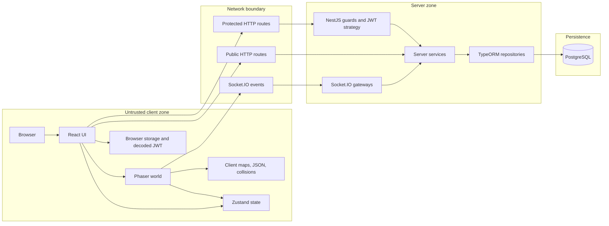

# Client Server Trust

## Metadata

- Status: Draft
- Owner: Project
- Last updated: 2026-06-18
- Depends on: docs/README.md, docs/01_Architecture/client-server-boundaries.md, docs/01_Architecture/realtime-socketio.md
- Used by: Project owner, developers, conversational assistants, repository-aware coding agents

## Scope

This document describes the client/server trust model and security boundaries
observed in the current repository.

It distinguishes untrusted components, user-controlled data, authentication,
authorization, server-side validation, client state, server memory state,
persistent state, verified protections, and protections that remain `Not
verified` or `TBD`.

## Verification labels

- `Implemented`: verified in the current repository code.
- `Configured`: present in configuration, but runtime usage may not be verified.
- `Not verified`: the inspected code did not provide enough evidence.
- `TBD`: intentionally unresolved or still to be documented.

These labels describe only the state observed at `Last updated`.

## Purpose

This document defines:

- Trust assumptions for the browser, client code, server code, and persistence.
- Surfaces that can be controlled or modified by a user.
- Validations that must remain server-side.
- Security controls observed in the repository.
- Security gaps and unverified protections that still need review.

It is descriptive. It does not create a new security architecture and does not
prove that the project is secure.

## Core security rule

Every gameplay or network change must ask:

```text
What happens if the client is fully modified by a malicious user?
```

Architecture constraints:

- The browser is untrusted.
- React is untrusted.
- Phaser is untrusted.
- Zustand is untrusted.
- Browser storage is untrusted.
- Client-side maps, JSON files, collision data, and Tiled properties are
  untrusted.
- The admin interface is untrusted.
- Client Socket.IO events are intentions or requests.
- The server must validate security-sensitive gameplay effects.

These are architecture constraints. They are not proof that every validation is
already implemented.

## Protected assets

The project must protect:

- User accounts.
- JWT tokens.
- Characters.
- Positions.
- Inventories.
- Equipment.
- Items.
- Resources.
- Loot.
- Animals.
- Health points.
- Cooldowns.
- Administrative permissions.
- Creature templates and spawns.
- Map and mobility data.
- Persistent PostgreSQL state.
- Password hashes.
- JWT signing secrets.
- Active authenticated sessions.

No real secret, token, password, credential, connection string, personal data,
or environment value is documented here.

## Trust boundary matrix

A server-controlled component is inside the trusted execution zone, but it is
not automatically correct or secure.

`Trusted` in this table means that the component is controlled by the server
and is allowed to participate in authoritative processing. It does not remove
the need for validation, authorization, error handling, and secure
configuration.

| Component or data source | Trusted? | May be modified by user? | Allowed responsibility | Forbidden authority | Status |
|---|---|---|---|---|---|
| React | No | Yes | Render UI, collect input, call HTTP endpoints, display admin panel. | Authorize actions, grant roles, validate gameplay effects, create authoritative state. | Implemented |
| Phaser | No | Yes | Render world, handle local input, predict or display movement, emit intentions. | Decide authoritative movement, mobility, collisions, combat, loot, or resources. | Implemented |
| Zustand | No | Yes | Store local client UI and display state shared by React and Phaser. | Authorize server actions, create items, move characters, grant permissions, decide gameplay truth. | Implemented |
| Browser storage | No | Yes | Store the JWT and local browser state. Browser storage can be read by client-side JavaScript and does not protect a token from a successful XSS or compromised browser environment. | Prove identity by itself, prove role by decoded payload, protect secrets from the user. | Implemented |
| Client-decoded JWT payload | No | Yes | Display conditional UI such as the admin tab. | Authorize admin actions or prove role server-side. | Implemented |
| Socket.IO client payload | No | Yes | Send requests or intentions to the server. | Become gameplay truth without server validation. | Implemented |
| Tiled JSON | No | Yes | Support client rendering or local prediction. | Decide server-side mobility or collisions. | Implemented / Not verified |
| Client collision data | No | Yes | Support local rendering, interaction, or pathfinding. | Authorize movement through blocked zones. | Implemented / Not verified |
| Admin interface | No | Yes | Provide operator UI and send admin requests. | Bypass server authentication, authorization, payload validation, or audit needs. | Implemented / Not verified |
| NestJS guards | Server-controlled, not automatically sufficient | No direct user modification | Participate in JWT and role checks for protected HTTP routes. | Replace domain-specific ownership or gameplay validation. | Implemented |
| Socket.IO gateways | Server-controlled, not automatically sufficient | No direct user modification | Authenticate sockets where implemented, validate payloads, route events to services. | Trust client payloads without checks. | Implemented / Not verified |
| Server services | Server-controlled, not automatically sufficient | No direct user modification | Apply business rules, ownership checks, persistence decisions, combat/resource logic. | Trust client state without validation. | Implemented / Not verified |
| TypeORM | Server-controlled data access layer | No direct user modification | Persist and query server-side state through repositories. | Act as standalone authorization, security, or gameplay validator. | Implemented |
| PostgreSQL | Server-controlled persistence | No direct user modification | Store persistent accounts, characters, inventory, resources, animals, and templates. Persisted data may be stale, inconsistent, or produced by a server bug. | Act as authorization authority or standalone gameplay validation engine. | Implemented |

## Authentication versus authorization

Authentication identifies who the user is.

Authorization verifies whether that authenticated user may perform a specific
action.

Rules:

- A valid JWT does not grant every permission.
- A decoded JWT role in the browser is not server proof.
- Displaying an admin panel is not authorization.
- Each sensitive action must apply the relevant server-side checks.
- Authentication must be combined with ownership, role, target, payload, and
  gameplay validation when those checks are relevant.

Implemented:

- HTTP protected routes use `JwtAuthGuard`.
- `JwtStrategy` reads bearer tokens, validates signature and expiration, and
  places `userId`, `username`, and `role` on `req.user`.
- `RolesGuard` checks required roles from metadata against `request.user.role`.
- Admin HTTP routes use `JwtAuthGuard`, `RolesGuard`, and `@Roles(UserRole.ADMIN)`.
- Item write routes use `RolesGuard` with `UserRole.ADMIN`.
- WebSocket auth for `WorldGateway`, `ResourcesGateway`, and `AnimalsGateway`
  uses `WsAuthService`.
- `join_world` checks character ownership server-side before joining the world.

Not verified:

- Independent WebSocket authentication in `AdminGateway`.
- Guaranteed provenance of `client.data.role` before every admin event.
- Connection-hook ordering between gateways sharing the default namespace.
- Full authorization coverage for every inventory route.
- JWT revocation or forced logout after token compromise.
- JWT signing-secret rotation strategy.
- Session invalidation after role, password, or account-status changes.

## HTTP trust boundary

Implemented:

- NestJS uses a global `ValidationPipe` with `whitelist`,
  `forbidNonWhitelisted`, `transform`, and implicit conversion enabled.
- `/auth/register` and `/auth/login` use DTOs with string validation; register
  requires password length of at least six characters.
- `AuthService` hashes passwords with bcrypt before saving.
- `AuthService.login` checks user existence, active status, password match, and
  returns a signed JWT.
- Character routes are protected with `JwtAuthGuard`.
- Character list and current-character routes use `req.user.userId`.
- Character read and delete by id verify ownership through `findOne(id, userId)`.
- Character unequip verifies ownership through `findOne(characterId, userId)`.
- Admin HTTP routes are protected by JWT and admin role guards.
- Item create, update, and delete routes require admin role.

Not verified:

- Complete UUID validation for all route parameters.
- Complete ownership validation for inventory routes that accept `characterId`
  directly.
- Complete ownership validation for the observed character equip flow using the
  supplied `characterId`.
- Admin template HTTP `PATCH` field whitelist equivalent to the WebSocket
  admin template whitelist.
- Full error contract consistency across HTTP routes.

Observed risks:

- `InventoryController` is JWT-protected but accepts `characterId` parameters
  directly. Ownership checks were not verified in the controller path inspected.
- Some service methods validate existence and persistence state, but existence
  is not the same as ownership.

Security boundaries:

- CORS is a browser-enforced access policy. It is not authentication or
  authorization, and non-browser clients are not constrained by it.
- The global NestJS `ValidationPipe` applies to compatible HTTP controller
  inputs. It does not automatically validate arbitrary Socket.IO payloads.
- DTO validation does not replace ownership, permission, target, or gameplay
  validation.

## WebSocket trust boundary

Implemented:

- The Socket.IO client sends the JWT in the handshake `auth.token`.
- `WsAuthService` also supports an `Authorization: Bearer ...` handshake header.
- `WsAuthService` verifies the JWT and returns `userId`, optional `username`,
  and optional `role`.
- `WorldGateway`, `ResourcesGateway`, and `AnimalsGateway` call `WsAuthService`
  in `handleConnection`.
- Invalid WebSocket authentication disconnects the socket in those gateways.
- Authenticated gateways set `client.data.userId` and `client.data.role`.
- `join_world` sets `client.data.player` after server-side ownership checks.
- Resource and animal events use `client.data.player` instead of trusting the
  client-supplied character id.
- Admin Socket.IO events check `client.data.role === 'admin'`.

Not verified:

- Independent authentication hook in `AdminGateway`.
- Whether `client.data.role` is always initialized by a server-side
  authentication path before admin events are handled.
- Gateway connection-hook ordering on the default namespace.
- Full payload DTO validation for all WebSocket events.
- Rate limiting, replay protection, and idempotence for general WebSocket
  events.

Security rule:

- A WebSocket connection being authenticated does not make every event
  authorized.
- Every event still needs event-specific validation for payload, ownership,
  target, permissions, and gameplay effects.
- Socket.IO payloads require explicit validation in the relevant gateway or
  service; the global HTTP validation pipe must not be assumed to validate
  them.

## Movement, mobility and collision security

### Architecture constraints

- The client may calculate or predict visual movement.
- Phaser position is never authoritative.
- Zustand position or character state is never authoritative.
- Phaser collisions are not authoritative.
- Modifying a client-side map or `walkable` property must not allow a player to
  cross a forbidden area.
- The server must be able to reject or correct invalid movement.

### Implemented

- `join_world` verifies that the character belongs to the authenticated socket
  user.
- The server uses persisted character position when available during join.
- `player_move` checks that x and y are numbers.
- Server memory stores connected-player position.
- Position is persisted on disconnect and admin teleport.

### Not verified

- Maximum speed validation.
- Allowed distance validation.
- Elapsed-time validation.
- Forbidden teleport prevention.
- Server-side gameplay collision validation.
- Server-side blocked-zone validation.
- Authoritative server-side map validation.
- Client reconciliation after rejected movement.
- Server-side spam protection for `player_move`.

## Maps, chunks and world authority

Implemented:

- Client map and collision-related files exist under client assets and Phaser
  map code.
- Phaser map helpers exist for tilemap and collision setup.
- Client-side pathfinding and collision-related helpers may support local
  movement or rendering.

Not verified:

- Active full Tiled rendering in the inspected world scene.
- Authoritative server-side map data.
- Server-side chunk authority.
- Server-side mobility grid.
- Server-side gameplay collision source.
- Server-side validation against Tiled or equivalent map data.

Boundary:

- Rendering a map is separate from validating gameplay movement.
- Client-side chunks, collisions, and map properties are not trusted.

## Resources, loot and inventory

Implemented:

- `interact_resource` requires a string `targetId`.
- The resource gateway uses `client.data.player` from the joined world session.
- Client-provided character id is not used as the gathering owner.
- Resource existence is checked server-side.
- Resource depleted/dead state is checked server-side.
- Resource range is checked using server-side connected-player position.
- Re-clicking the same target while a gathering session exists is ignored.
- Switching target cancels the previous gathering session.
- Each gathering cycle rechecks socket connection, joined player, movement,
  resource state, remaining loots, and range.
- Loot is generated server-side.
- Inventory is updated through `InventoryService.addItem`.
- Resource state is updated through `ResourcesService.consumeLoot`.
- Inventory and resource updates are persisted through TypeORM repositories.

Not verified:

- Transaction or locking strategy for concurrent gathering of the same resource.
- Exactly-once loot delivery.
- Replay protection for old `interact_resource` messages.
- General rate limiting for repeated resource messages.
- Full ownership validation for all HTTP inventory routes.
- Protection against repeated writes caused by retries or duplicated events.

Security boundary:

- Client inventory display and Zustand inventory state are not authoritative.
- Persistent inventory changes must come from validated server-side logic.

## Animals and combat

Implemented:

- `attack_animal` requires a string `targetId`.
- The gateway uses `client.data.player` from the joined world session.
- `AnimalsService.attack` checks attack cooldown.
- Animal existence and dead state are checked.
- Character existence and health are checked.
- Attack range is derived from server-side character equipment and checked
  against server-side connected-player position.
- Successful attacks apply damage server-side.
- Animal state is persisted.
- Riposte can update character health server-side.
- Respawn can persist character position and health.
- Live animals, patrol states, and cooldown maps are kept in server memory.

Not verified:

- General spam protection beyond attack cooldown.
- Idempotence for duplicated attack events.
- Replay protection for old attack events.
- Complete recovery of live combat state after server restart.
- Full handling of client/server divergence for displayed animal state.

## Admin security

Implemented:

- React may show the admin tab based on decoded JWT role, but this is UI only.
- Admin HTTP routes use `JwtAuthGuard`, `RolesGuard`, and `@Roles(UserRole.ADMIN)`.
- Admin Socket.IO event handlers check `client.data.role === 'admin'`.
- Observed admin commands include spawn, teleport, template update, animal move,
  and respawn all.
- Admin WebSocket commands validate required payload fields.
- Admin template update uses a whitelist of editable fields and numeric
  non-negative values.
- Admin teleport resolves a connected target player before applying the
  operation.

Not verified:

- Independent WebSocket authentication in `AdminGateway`.
- Guaranteed server-authenticated provenance of `client.data.role` before every
  admin event.
- Gateway connection-hook ordering on the default namespace.
- Complete protection against repeated admin commands.
- Operation identifiers, idempotence, or deduplication for admin actions.
- Audit trail or durable traceability for admin operations.
- Equivalent whitelist validation for all admin HTTP update paths.

Security rules:

- The official admin interface is not trusted.
- `client.data.role` must come from guaranteed server-side authentication.
- A client timeout does not cancel a server operation.
- Replaying an admin command can produce a duplicated effect if idempotence is
  not enforced.

## Input validation

| Input category | Source | Validation observed | Missing or unverified validation | Status |
|---|---|---|---|---|
| UUID and identifiers | HTTP params, DTOs, Socket.IO payloads | Some DTOs use `IsUUID`; WebSocket target ids are checked as strings. | UUID validation not verified for all route params and WebSocket ids. | Implemented / Not verified |
| Coordinates | Phaser, admin commands, movement events | Some handlers check numeric x/y; admin commands check numeric coordinates. | Speed, distance, elapsed time, collisions, blocked zones, and map authority not verified. | Implemented / Not verified |
| Names or templates | Character creation, admin templates | Character names use string and min length; admin template keys are checked for existence. | Full naming policy and HTTP template field whitelist not verified. | Implemented / Not verified |
| Numbers | DTOs and admin fields | Global validation pipe; admin template fields parsed as numbers and checked non-negative in WebSocket path. | Numeric constraints not verified for every HTTP body. | Implemented / Not verified |
| Inventory | HTTP routes, resource loot | Inventory DTO validates create body; resource loot uses server-side inventory service. | Ownership and concurrent update protection not verified for every inventory route. | Implemented / Not verified |
| Resources | Socket.IO `interact_resource` | Target string, joined player, existence, range, state, movement during gathering. | Replay, rate limiting, and transaction/locking not verified. | Implemented / Not verified |
| Animals | Socket.IO `attack_animal` | Target string, joined player, cooldown, range, character and animal state. | Replay and general spam protection beyond cooldown not verified. | Implemented / Not verified |
| Admin commands | Socket.IO admin events | Role check, required fields, template whitelist for WebSocket template update. | Independent gateway auth, idempotence, deduplication, and audit not verified. | Implemented / Not verified |
| Roles | JWT payload, request user, socket data | HTTP roles guard checks `request.user.role`; admin socket checks `client.data.role`. | Admin socket role provenance and connection-hook ordering not verified. | Implemented / Not verified |
| Client maps or properties | Phaser/Tiled/map files | No server-side trust observed. | Server authoritative map, mobility, and collision validation are `TBD` or `Not verified`. | Not verified / TBD |

## Replay, duplication and abuse

Implemented:

- Client movement sync is throttled client-side to at most one `player_move`
  emission per 80 ms window when position or direction changes.
- Resource gathering ignores repeated clicks on the same target while a session
  exists.
- Resource gathering cancels the previous target when switching targets.
- Animal attacks have a server-side cooldown.
- Admin commands use acknowledgements with a client-side timeout.

Not verified:

- Server-side movement rate limiting.
- General WebSocket rate limiting.
- Replay protection for old messages.
- Exactly-once event semantics.
- Idempotence for critical operations.
- Deduplication keys or operation identifiers.
- Safe retry policy after client-side timeout.
- Abuse metrics or automated blocking.

Security rules:

- Client throttling is not a security protection.
- A client timeout does not cancel server processing.
- Socket.IO must not be treated as exactly-once delivery.
- Durable abuse protection must be server-side.

## State and persistence security

Client state:

- React, Phaser, Zustand, browser storage, client maps, and decoded JWT payloads
  are not trusted.
- Client state may be useful for display, prediction, and local UI flow only.

Server memory:

- Connected players and live connected positions are held in
  `WorldService.connectedPlayers`.
- Gathering sessions and timers are held in `ResourcesGateway`.
- Live animals, patrol states, and cooldowns are held in `AnimalsService`.
- Socket user and role data are held in `client.data`.

Persistent state:

- PostgreSQL stores users, characters, inventory, items, resources, animals,
  templates, spawns, equipment, and respawn points through TypeORM.
- Persisted position and live connected-session position are distinct.
- PostgreSQL stores data but does not validate gameplay rules by itself.

Not verified:

- Complete crash recovery for server memory state.
- Full memory/database resynchronization after reconnect.
- Concurrent write safety for critical inventory, loot, resource, or economy
  operations.
- Protection against persisting unvalidated client movement.

## Secrets and sensitive data

Forbidden in documentation, logs, prompts, commits, and examples:

- Real `.env` values.
- Real JWT tokens.
- Passwords.
- Connection strings.
- Private keys.
- Credentials.
- Real personal or sensitive user data.

Use synthetic examples only. Environment variable names may be documented, but
their real values must not be copied.

## Logging and observability

Observed:

- Some gateway rejections use `console.warn`.
- Animal patrol tick errors are caught and logged with `console.error`.
- Admin WebSocket handlers return success or failure acknowledgement objects.
- HTTP errors use NestJS exceptions in several services.

Not verified:

- Structured security audit logs.
- Admin operation audit trail.
- Metrics for rejected events, rate, replay, or abuse.
- Centralized logging policy.
- Redaction policy for sensitive data.

Logging rule:

- Logs must not contain full JWTs, passwords, secrets, credentials, or
  unnecessary sensitive data.

## Threat scenarios

| Threat scenario | Client capability | Required server defense | Observed state | Status |
|---|---|---|---|---|
| Modify own position | Client can send arbitrary `player_move` x/y. | Validate speed, distance, elapsed time, map, collision, and teleport rules server-side. | Basic numeric x/y check observed; full movement validation not verified. | Not verified |
| Disable collisions | Client can alter Phaser collision behavior. | Server-side collision and mobility validation. | Server collision authority not verified. | Not verified |
| Modify `walkable` | Client can alter map or tile properties. | Server authoritative map/mobility data. | Server map authority is `TBD` or not verified. | Not verified / TBD |
| Forge Socket.IO event | Client can emit arbitrary event payloads. | Authenticate socket and validate each event payload and authorization. | Some event checks observed; full coverage not verified. | Implemented / Not verified |
| Attack too fast | Client can emit repeated `attack_animal`. | Server-side cooldown and rate limiting. | Attack cooldown observed; general spam protection not verified. | Implemented / Not verified |
| Collect twice | Client can repeat `interact_resource`. | Session checks, idempotence, locking, and persistence consistency. | Same-target session ignore observed; locking/idempotence not verified. | Implemented / Not verified |
| Modify Zustand inventory | Client can change local inventory display. | Server-side inventory persistence and authorization. | Resource loot updates server-side; all inventory route ownership not verified. | Implemented / Not verified |
| Spoof admin role in client | Client can modify decoded JWT display logic. | Server-side role checks from verified auth. | HTTP admin guards observed; admin socket role provenance not fully verified. | Implemented / Not verified |
| Repeat admin command | Client can retry after timeout or replay command. | Idempotence, deduplication, audit, authorization. | Role checks observed; idempotence/deduplication/audit not verified. | Not verified |
| Target another player's entity | Client can submit another id. | Ownership and target authorization checks. | Character ownership observed for several routes and `join_world`; full coverage not verified. | Implemented / Not verified |
| Replay old message | Client can resend old payloads. | Nonces, timestamps, idempotence, or server-side state checks. | Some state checks observed; general replay protection not verified. | Not verified |
| Steal a stored JWT | Malicious script or compromised browser environment can read client-accessible storage. | Prevent script injection, limit token exposure, validate token server-side, and provide a compromise-response strategy. | JWT is stored in browser storage; token theft mitigation and revocation strategy were not verified. | Not verified |
| Brute-force or credential-stuff login | Attacker can submit repeated login attempts. | Server-side rate limiting, monitoring, account protection, and safe authentication errors. | Password verification exists; login abuse protection was not verified. | Not verified |

## Verified protections

Verified in code:

- HTTP JWT authentication with `JwtAuthGuard`.
- JWT strategy validates bearer token signature and expiration.
- Passwords are hashed with bcrypt during registration.
- Global NestJS validation pipe is configured.
- HTTP admin routes use `JwtAuthGuard`, `RolesGuard`, and `@Roles(UserRole.ADMIN)`.
- Item write routes use admin role guard.
- WebSocket JWT authentication exists for `WorldGateway`, `ResourcesGateway`,
  and `AnimalsGateway`.
- Character ownership is checked for character read/delete and world join.
- Resource gathering checks joined player, target existence, resource state,
  range, and movement during gathering.
- Resource loot and inventory update are performed server-side.
- Animal attack checks cooldown, target, character state, server-side range, and
  equipment-derived range.
- Admin WebSocket template update uses an allowed-field whitelist.

## Known gaps

- Complete server-side movement validation is not verified.
- Authoritative server-side map, mobility, and collision data are `TBD` or not
  verified.
- General rate limiting is not verified.
- Replay protection is not verified.
- Idempotence and deduplication are not verified.
- Admin audit trail is not verified.
- Crash recovery for server memory state is not fully verified.
- Database concurrency strategy for critical operations is not verified.
- No room-, zone-, chunk-, or map-area-scoped broadcast usage was observed in
  the inspected code.
- Shared event contracts are not documented as a formal package.
- Independent authentication for `AdminGateway` is not verified.
- Full ownership validation for every inventory and equipment path is not
  verified.
- Login brute-force and credential-stuffing protection are not verified.
- JWT revocation, forced logout, and token-compromise response are not verified.

## Security review checklist

- [ ] Client input is treated as untrusted.
- [ ] Authentication and authorization are both checked.
- [ ] Ownership is validated.
- [ ] Target identifiers are validated.
- [ ] Gameplay effects are computed or approved server-side.
- [ ] Duplicate and replay risks are considered.
- [ ] Rate and abuse risks are considered.
- [ ] Persistence happens only after validation.
- [ ] No secret or sensitive value is exposed.
- [ ] Admin actions receive server-side authorization.

## Trust diagram



Public authentication routes do not use JWT guards, but they still require DTO,
credential, account-state, and abuse validation.

Protected routes require authentication and may also require authorization,
ownership, and domain-specific validation.

## Non-goals

- This document does not prove that the project is secure.
- This document does not replace a security audit.
- This document does not create any security mechanism.
- This document does not modify code.
- This document does not replace tests.
- This document does not create an ADR.
- This document does not describe every possible threat.

## Security notes

- The client is untrusted.
- The server must remain authoritative for sensitive gameplay effects.
- Authentication is different from authorization.
- Server-side validation is required before persistence or gameplay effects.
- Secrets, credentials, real JWTs, and real `.env` values are excluded.

## Performance notes

This document has no runtime impact.

Security protections can have runtime cost, including rate limiting, validation,
database reads, transactions, logs, and deduplication. This document does not
propose premature optimization.

## Related files

- [Documentation Index](../README.md)
- [Architecture Overview](../01_Architecture/overview.md)
- [Client Server Boundaries](../01_Architecture/client-server-boundaries.md)
- [Realtime Socket.IO](../01_Architecture/realtime-socketio.md)
- [Authentication JWT](authentication-jwt.md)
- [Admin Permissions](admin-permissions.md)
- [Phaser World](../03_Client/phaser-world.md)
- [Server WebSockets](../04_Server/websockets.md)
- [Maps and Collisions](../05_World/maps-and-collisions.md)
- [World Chunks](../05_World/chunks.md)
- [Review Checklist](../09_Workflow/review-checklist.md)
- [Golden Rules](../10_AI/golden-rules.md)
- [STATUS.md](../../STATUS.md)

## Open questions

- What is the authoritative movement strategy?
- How should server-side maps and collisions be represented?
- Where should rate limiting be enforced?
- Which operations require idempotence?
- What audit trail is required for admin actions?
- How should state recover after server restart?
- How should server memory and PostgreSQL be synchronized?
- How should trust boundaries work in a future multi-instance deployment?

## TODO

- [ ] Validate this trust model with a human reviewer.
- [ ] Compare this document with specialized security and architecture
  documents once they are filled.
- [ ] Create an ADR only if mobility or map authority requires a durable
  architecture decision.
- [ ] Perform a targeted audit of `AdminGateway` authentication and role
  provenance.
- [ ] Move this document to `Review` when it is ready for validation.
